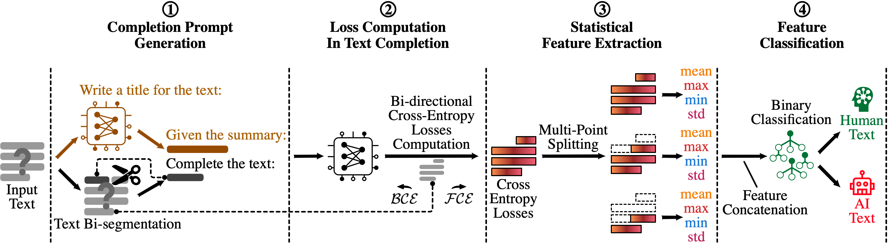
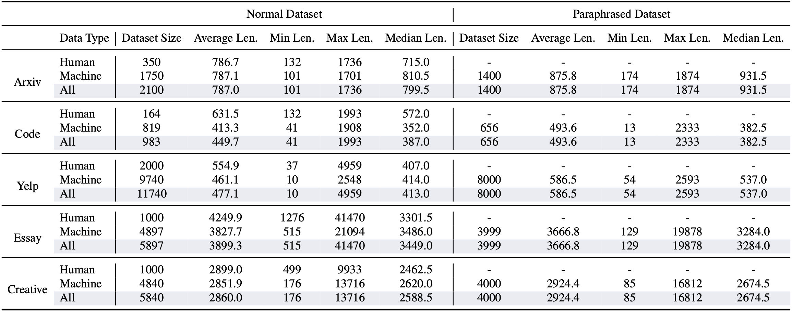

# BiScope: AI-generated Text Detection by Checking Memorization of Preceding Tokens

Shield: [![CC BY-NC-ND 4.0][cc-by-nc-nd-shield]][cc-by-nc-nd]

This work is licensed under a
[Creative Commons Attribution-NonCommercial-NoDerivs 4.0 International License][cc-by-nc-nd].

[![CC BY-NC-ND 4.0][cc-by-nc-nd-image]][cc-by-nc-nd]

[cc-by-nc-nd]: http://creativecommons.org/licenses/by-nc-nd/4.0/
[cc-by-nc-nd-image]: https://licensebuttons.net/l/by-nc-nd/4.0/88x31.png
[cc-by-nc-nd-shield]: https://img.shields.io/badge/License-CC%20BY--NC--ND%204.0-lightgrey.svg

---

Table of Contents
---
- [Overview](#overview)
- [Dataset](#dataset)
- [Code Implementation](#code-implementation)
- [Running the Code](#running-the-code)


## Overview
- This is the official implementation for NeurIPS 2024 paper "[BiScope: AI-generated Text Detection by Checking Memorization of Preceding Tokens](https://neurips.cc/virtual/2024/poster/95814)".
- [[video](https://neurips.cc/virtual/2024/poster/95814)\] | \[[slides](https://neurips.cc/media/neurips-2024/Slides/95814.pdf)\] | \[[poster](https://neurips.cc/media/PosterPDFs/NeurIPS%202024/95814.png?t=1733630920.046255)\] | \[[paper](https://openreview.net/pdf?id=Hew2JSDycr)\]
  


## Dataset
- We extend existing datasets by crafting more AI-generated data using five latest commercial LLMs, including GPT-3.5-Turbo, GPT-4-Turbo, Claude-3-Sonnet, Claude-3-Opus, and Gemini-1.0-Pro.
- Our Datasets consist of 2 short natural language datasets (Arxiv, Yelp), 2 long natural language datasets (Creative, Essay), and 1 code dataset (Code).
- We craft both the non-paraphrased version (`./Dataset`) and paraphrased version (`./Paraphrased_Dataset`) for each AI-generated data.
- Detailed dataset statistics:


## Code Implementation

### Code Structure

The project is organized into two main Python files:

- **biscope.py:**  
  This is the main script that:
  - Parses command line arguments.
  - Sets up evaluation strategies:
    - In-domain evaluation: 5-fold cross validation when training and testing datasets are identical.
    - Out-of-domain evaluation:
      - **Cross-model OOD (same task):** When the task is the same but the generative model or paraphrase status differs, the classifier is trained on human and GPT training data and tested only on GPT test data (using accuracy).
      - **Cross-domain OOD (different task):** When the task changes, both human and GPT test data are used for evaluation (using F1 score).
  - Saves feature files and evaluation results in a structured output directory.

- **biscope_utils.py:**  
  Contains utility functions for feature extraction using pretrained language models from Hugging Face Transformers. The features are computed by:
  - Generating a summary-based prompt.
  - Tokenizing and computing loss values over segments of the text.
  - Saving the features as pickle files.

---

### Running the Code

**1. Set up your environment:**  
```bash
conda create -n biscope_env python=3.11
conda activate biscope_env
# install pytorch, please refer to https://pytorch.org/get-started/previous-versions/ to install the newest version that fit your device. We only show the install commands for the latest pytorch version.
pip3 install torch torchvision torchaudio
# install other dependencies
pip install transformers scikit-learn tqdm numpy openai tenacity accelerate
```

**2. Run the code:**

First, please set up the GPU devices, e.g.,
```bash
export CUDA_VISIBLE_DEVICES=0,1
```

If you want to use openai models (e.g., gpt-4o-mini) as the summary model, please also set up the openai key:
```bash
export OPENAI_API_KEY={Your OpenAI Key}
```

Then, you can run the code with the following command:
```bash
python bisocpe.py --train_dataset={train_dataset} --test_dataset={train_dataset} --detect_model={detect_model}
```
For more details of the arguments, please refer to the table below:
| **Argument**      | **Default / Choices**                                                                                   | **Explanation**                                                                                                                                                                                                                                           |
|-------------------|---------------------------------------------------------------------------------------------------------|-----------------------------------------------------------------------------------------------------------------------------------------------------------------------------------------------------------------------------------------------------------|
| `--seed`          | *Default:* 42                                                                                           | Sets the random seed for reproducibility in Python’s `random`, NumPy, and PyTorch.                                                                                                                               |
| `--sample_clip`   | *Default:* 2000                                                                                         | Maximum token length for each text sample. Samples longer than this will be truncated during tokenization.                                                                                                      |
| `--summary_model` | *Default:* `none` <br> *Choices:* `none`, or a summary model key (e.g., `llama2-7b`, `gpt-3.5-turbo`)      | Specifies the summary model used to generate a concise prompt from the text sample. If set to `none`, no summary-based prompt is generated.                                                                     |
| `--detect_model`  | **Required** <br> *Choices:* Must be one of the keys in the model zoo (e.g., `llama2-7b`, `llama2-13b`, `llama3-8b`, `gemma-2b`, `gemma-7b`, `mistral-7b`) | Specifies the detection model used for feature extraction. This model is responsible for computing the loss features that indicate memorization of preceding tokens. We recommend  ```llama-2-7b``` for most of the cases.                                                |
| `--train_dataset` | **Required** <br> *Format:* `{paraphrased or nonparaphrased}_{task}_{generative_model}` (e.g., `nonparaphrased_Arxiv_gpt-3.5-turbo`) | Indicates the training dataset. The first part specifies whether the dataset is paraphrased or nonparaphrased, the second part specifies the task/domain (e.g., Arxiv, Code, Essay), and the third part indicates which LLM generated the data. |
| `--test_dataset`  | **Required** <br> *Format:* Same as `--train_dataset`                                                 | Indicates the testing dataset. If same as the ```--train_dataset```, then test in in-distribution setting. In a cross‑model OOD setting (when the task is the same but the generative model/paraphrase status changes), only the GPT data is used for testing. In other OOD cases (task changes), both human and GPT data are used.        |
| `--use_hf_dataset`  | *Default* `False` <br> *Choices:* `True`/`False`                                                | When set to `True`, the dataset is loaded from the Hugging Face dataset `HanxiGuo/BiScope_Data` using the `datasets` library. Otherwise, the code uses the local JSON files for data loading.        |
